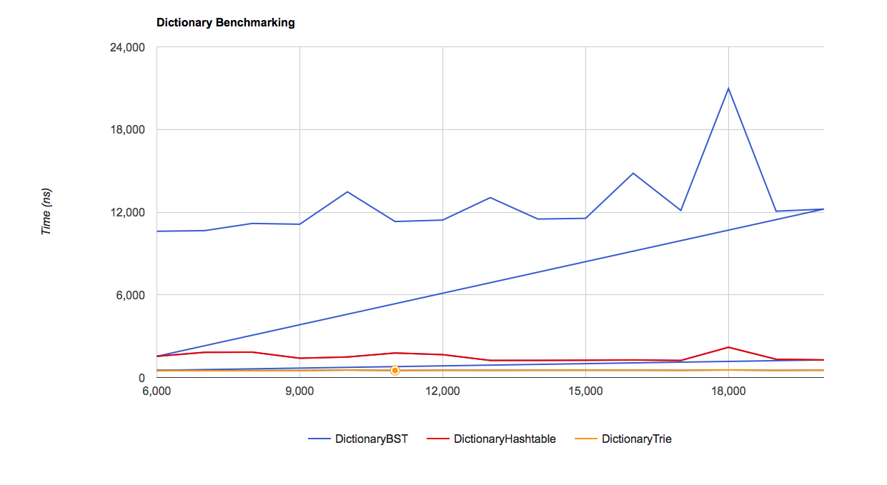

1. For `trie.find()` I expect `D` since I'm just traveling down the tree. For `bst.find()` I expect `log(N)` based on the docs. For `hash.find()` I expect `N` based on the docs. 
2. I don't think these look like the results I want. As in, I'm pretty sure the graph should look different dispite the data. (I'm on a Mac using Safari.). 
3. I store the max frequency of each node's decendents. I do BFS ordered by max frequency. If I've found enough words and a subtree's max frequency is below the min of found words, I don't search it. This algorithm sounds like it saves time, but apparently it doesn't. I *think* the runtime is `O(D + C + D) = O(D + C)` due to the two traversials and the breadth first search similirity. 
